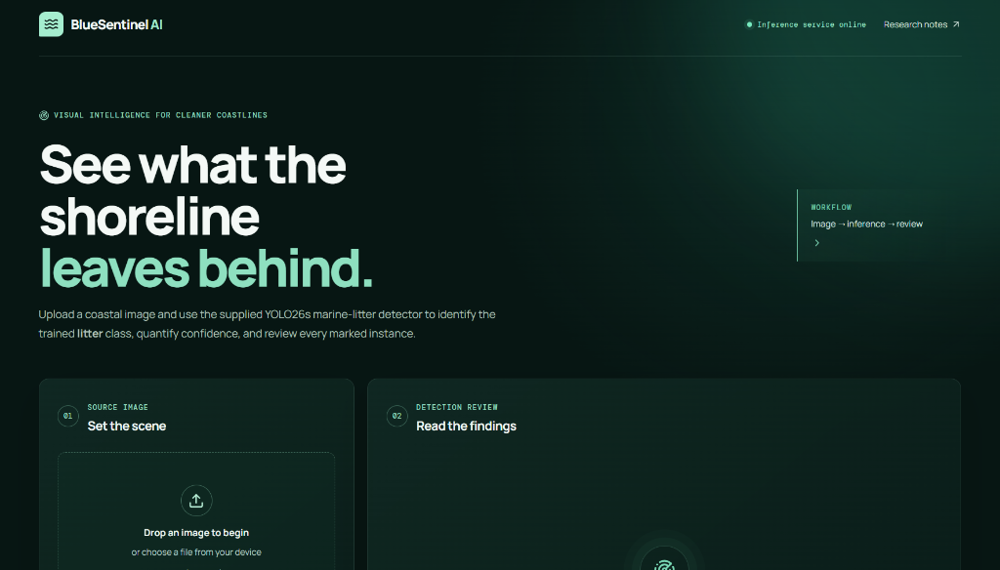

# Sentinel

A web tool for detecting litter in coastal photographs. Upload a shoreline image and a YOLO26s model finds litter in it, returning bounding boxes and confidence scores drawn over the image.

**Live demo:** [sentinel-sonalhegde.vercel.app](https://sentinel-sonalhegde.vercel.app)

> The inference API runs on Render's free tier and spins down after inactivity. The first request after a quiet period can take 15–30 seconds to respond.

---

## Screenshot



*(Upload panel on the left, annotated result on the right. Boxes and confidence scores are drawn as an SVG overlay on your local image preview.)*

---

## What it does

- Upload a JPEG, PNG, or WebP coastal photograph (up to 4 MB)
- Sends the image to a FastAPI inference service
- Runs a YOLO26s model fine-tuned to detect the `litter` class
- Returns bounding boxes, confidence scores, and inference metadata
- Draws the boxes as an SVG overlay on your image in the browser

The model currently has **one class: litter**. It does not distinguish debris type (plastic, fabric, fishing gear, etc.). See [Limitations](#limitations).

---

## Tech stack

| Layer | Technology |
|---|---|
| Frontend | React 19, TypeScript, Vite, Tailwind CSS v4 |
| Backend | Python 3, FastAPI, Uvicorn |
| Model runtime | ONNX Runtime (CPU), OpenCV, Pillow, NumPy |
| Model | YOLO26s — custom fine-tuned checkpoint |
| Frontend hosting | [Vercel](https://vercel.com) |
| Inference API hosting | [Render](https://render.com) (free tier) |

---

## How it works

The browser sends the image as a multipart POST to the FastAPI service. The service validates the bytes with Pillow, letterbox-resizes the image to 320×320 (the model's declared input size), normalises pixel values to 0–1 float32, and runs the YOLO26s ONNX artifact via ONNX Runtime. The output tensor is filtered at a 25% confidence threshold, then non-maximum suppression is applied at IoU 0.45. Surviving box coordinates are unscaled back to the original image dimensions and returned as JSON. The browser draws the boxes as an SVG layer over the local image preview — the original file is never re-fetched.

For a more detailed breakdown, see the [Docs page](https://sentinel-sonalhegde.vercel.app/docs) on the live site.

---

## Running locally

You need [Node.js](https://nodejs.org) (v18+), [pnpm](https://pnpm.io), and Python 3.11+.

**Clone the repo**

```bash
git clone https://github.com/Sonalhegde/litter-detect-app.git
cd litter-detect-app
```

**Start the inference API**

```bash
cd backend
python3 -m venv .venv
source .venv/bin/activate          # Windows: .venv\Scripts\activate
pip install -r requirements.txt
uvicorn app.main:app --reload --host 127.0.0.1 --port 8000
```

**Start the frontend** (in a second terminal, from the repo root)

```bash
pnpm install
pnpm dev
```

The Vite dev server runs on `http://localhost:5173` and proxies `/inference-api` requests to the local backend. You do not need to set `VITE_INFERENCE_API_URL` for local development.

---

## Environment variables

Copy the example files and edit as needed:

```bash
cp client/.env.example client/.env
cp backend/.env.example backend/.env
```

**Frontend** (`client/.env`)

| Variable | Description |
|---|---|
| `VITE_INFERENCE_API_URL` | Backend origin for production deploys. Not needed locally. |

**Backend** (`backend/.env`)

| Variable | Default | Description |
|---|---|---|
| `CORS_ALLOWED_ORIGINS` | localhost + Vercel URLs | Comma-separated list of allowed browser origins. |
| `YOLO26S_MODEL_PATH` | `models/yolo26s.onnx` | Path to the ONNX deployment artifact. |
| `YOLO26S_MODEL_SHA256` | *(pinned value)* | SHA-256 of the ONNX artifact; verified on startup. |
| `INFERENCE_CONFIDENCE_THRESHOLD` | `0.25` | Minimum confidence for a detection to be returned. |
| `INFERENCE_IOU_THRESHOLD` | `0.45` | IoU threshold for non-maximum suppression. |
| `MAX_UPLOAD_MB` | `4` | Maximum accepted upload size in MB. |
| `RATE_LIMIT_REQUESTS` | `6` | Max requests per client per rate-limit window. |
| `RATE_LIMIT_WINDOW_SECONDS` | `60` | Duration of the rate-limit window in seconds. |

---

## Dataset and model

The deployed model is a YOLO26s checkpoint fine-tuned to detect `litter` in coastal images. The exact source dataset for the current checkpoint was not included with the supplied weights, so a specific attribution cannot be confirmed.

The next model will be trained on **BePLi v2** (Beach Plastic Litter v2), a dataset of annotated coastal photographs from beaches in Japan, covering multiple litter-type categories (plastic bottles, bags, styrofoam, fishing gear, and others).

**BePLi v2 licence: [CC BY-NC-SA 4.0](https://creativecommons.org/licenses/by-nc-sa/4.0/)** — non-commercial use only, attribution required, derivatives must use the same licence. This applies to the training data and to any model weights derived from it; it does not apply to the application code (see [License](#license) below).

---

## Limitations

- **Single class.** The current model detects `litter` as one undifferentiated category. It does not identify material type, quantity by weight or volume, or classify a scene as "polluted" or "clean."
- **Accuracy varies.** Detection quality depends on lighting, camera angle, subject distance, occlusion, image compression, and how closely the image resembles the training data. Partially submerged or very small objects are more likely to be missed.
- **Zero detections ≠ no litter.** A result of zero means nothing crossed the 25% confidence threshold, not that the image is debris-free.
- **Not validated for formal use.** This tool has not been validated for scientific research, environmental monitoring, regulatory reporting, or operational field decisions.
- **Multi-class imbalance (upcoming).** Once the BePLi v2 model ships, per-class accuracy will vary because some litter categories appear far more often in the training data than others.

---

## Roadmap

- **Multi-class litter detection** — training on BePLi v2 is in progress. When complete, the model will return specific litter-type labels (plastic bottle, bag, fishing gear, etc.) instead of a single `litter` class.

---

## Running the tests

```bash
# Frontend type check and unit tests
pnpm run check
pnpm test

# Backend tests
cd backend
pytest -q
```

---

## Credits

Built by **Sonal Hegde**
[GitHub](https://github.com/Sonalhegde) · [LinkedIn](https://www.linkedin.com/in/sonal-hegde-/) · [sonalhhegde@gmail.com](mailto:sonalhhegde@gmail.com)

With guidance and mentorship from **Dr. Sachinandan Dutta**, Associate Professor, Department of Marine Science and Fisheries, Sultan Qaboos University, Muscat, Oman.
Research interests: fisheries management, ecosystem modelling, marine ecology.
[s.dutta@squ.edu.om](mailto:s.dutta@squ.edu.om)

---

## License

The application code is released under the [MIT License](LICENSE).

The training dataset (BePLi v2) is separately licensed under [CC BY-NC-SA 4.0](https://creativecommons.org/licenses/by-nc-sa/4.0/). That licence covers the data and any model weights derived from it; it does not govern the application source code.
