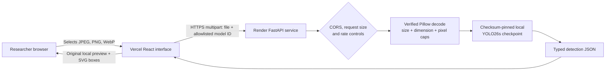

# BlueSentinel AI architecture

BlueSentinel AI is deliberately split into a static web interface and a constrained model-inference service. The browser never receives model weights and the inference service does not own a database or durable user-upload store. This reduces the public attack surface to a small multipart API and keeps the compute boundary explicit.

| Layer | Responsibility | Deliberate boundary |
| --- | --- | --- |
| Browser | File selection, local image preview, API error display, SVG box overlay. | A file is untrusted until the API validates its content. The browser does not make correctness or security decisions for the server. |
| Vercel frontend | Serves the React bundle and points requests to the configured inference API. | It contains no checkpoint and no private model-loading controls. |
| Render API | Applies CORS, request limits, safe errors, model-ID allowlisting, and serialized inference. | User input cannot select filesystem paths, provide weights, execute commands, or alter the configured checkpoint. |
| Decoder | Verifies actual JPEG, PNG, or WebP content and performs bounded RGB conversion in memory. | Declared filenames and MIME headers are not trusted as proof of the content type. |
| Model registry | Checks the supplied YOLO26s SHA-256 fingerprint and lazy-loads only configured local weights. | The project never fetches checkpoint URLs supplied by a request. |

## Runtime sequence

The interface submits a `multipart/form-data` request containing `file` and a selected model identifier. The route validates the identifier against a five-value allowlist. The image service reads a bounded number of bytes, verifies image structure, rejects unsupported formats and unsafe decoded dimensions, and closes the upload object. The inference service acquires a single execution slot, loads the trusted local checkpoint on first use, and returns typed bounding boxes, counts, latency, applied thresholds, input size, and detected runtime device.

No uploaded image is written by the application. The client overlays returned coordinates over its own object URL for the selected local file. The current per-instance rate limiter and concurrency gate are intentional public-demo controls; a production multi-instance service should replace them with a shared edge policy.
