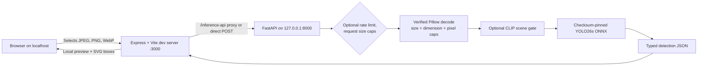

# Sentinel architecture

Sentinel is split into a local web interface and a constrained model-inference service. The browser never receives model weights and the inference service does not own a database or durable user-upload store. This keeps the compute boundary explicit and limits the attack surface to a small multipart API on localhost.

| Layer | Responsibility | Deliberate boundary |
| --- | --- | --- |
| Browser | File selection, local image preview, API error display, SVG box overlay. | A file is untrusted until the API validates its content. |
| Dev frontend (`server/` + Vite) | Serves the React UI and proxies `/inference-api` → `127.0.0.1:8000`. | Contains no checkpoint and no private model-loading controls. |
| FastAPI backend | CORS for local origins, request limits, safe errors, model-ID allowlisting, concurrent ONNX inference. | User input cannot select filesystem paths, provide weights, or alter the configured checkpoint. |
| Decoder | Verifies actual JPEG, PNG, or WebP content and performs bounded RGB conversion in memory. | Declared filenames and MIME headers are not trusted as proof of content type. |
| Model registry | Checks the YOLO26s SHA-256 fingerprint and lazy-loads only configured local weights. | The project never fetches checkpoint URLs supplied by a request. |

## Runtime sequence

The interface submits a `multipart/form-data` request containing `file` and a selected model identifier. The route validates the identifier against a five-value allowlist. The image service reads a bounded number of bytes, verifies image structure, rejects unsupported formats and unsafe decoded dimensions, and closes the upload object. The inference service acquires a concurrency slot, loads the trusted local checkpoint on first use, and returns typed bounding boxes, counts, latency, applied thresholds, input size, and runtime metadata.

No uploaded image is written by the application. The client overlays returned coordinates over its own object URL for the selected local file.
